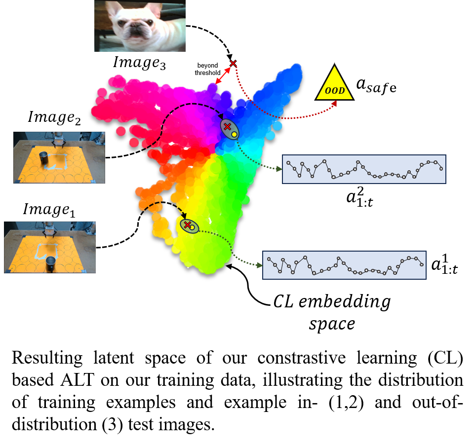

# Demystifying Diffusion Policies: Action Memorization and Simple Lookup Table Alternatives
This repository is the implementation of [Demystifying Diffusion Policies: Action Memorization and Simple Lookup Table Alternatives](https://arxiv.org/abs/2505.05787).
The paper is currently under review. 
This branch contains the basic version, trained on 30 trajectories. 
A more advanced version using 120 trajectories is available in the "multimodel" 
branch. Additionally, we provide code for training a generative model from 2D 
points uniformly distributed on 4 different shaped 1D manifold.



## Testing
To use our pretrained model, you can run the following command:
```
python rollout.py
```
We have two prepared virtual tests, InD_cases and OoD_cases, which are different types of tests respectively.

## Training
If you want to train the model, you can run the following command:
```
python training.py
```
after which you can train the model "fusion_encoder" with the default hyperparameters.
Then, run the following command to get the embedding of the raw data:
```
python data_creation.py
```
You will get the "traj_database.pt" file for further testing.
Run the following command to test the model:
```
python rollout.py
```
In the real robot experiments, you will also need to use the function "realtime_rollout" in rollout.py to get the action from the model.

## Reference
```
@article{he2025demystifying,
  title={Demystifying Diffusion Policies: Action Memorization and Simple Lookup Table Alternatives},
  author={He, Chengyang and Liu, Xu and Camps, Gadiel Sznaier and Sartoretti, Guillaume and Schwager, Mac},
  journal={arXiv preprint arXiv:2505.05787},
  year={2025}
}
```